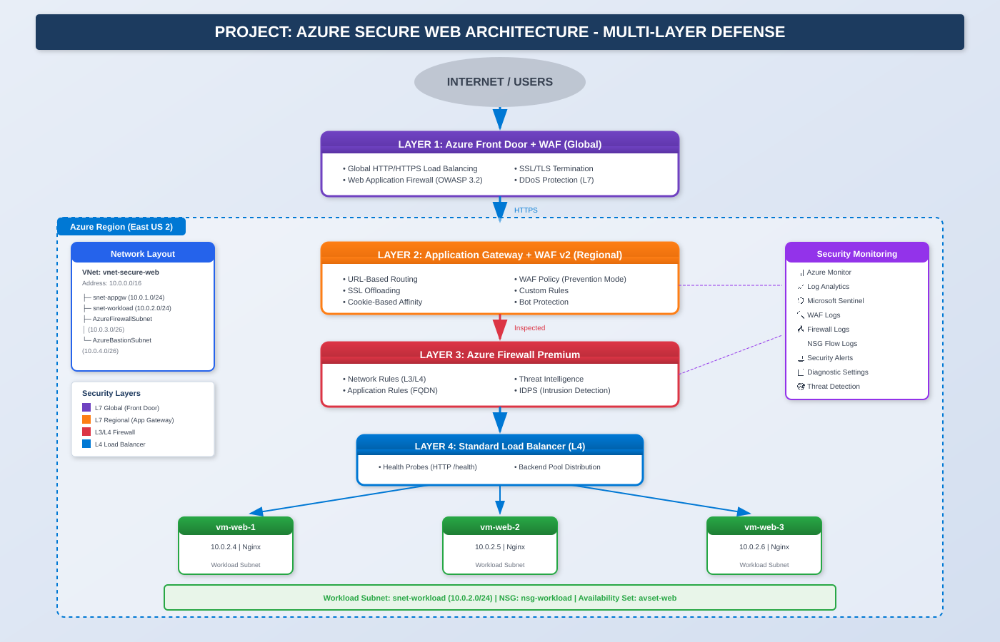

# Azure Secure Web Architecture - Multi-Layer Defense


## 📋 Overview

This lab implements an **enterprise-grade secure web architecture** with 4-layer defense-in-depth, including Azure Front Door, Application Gateway with WAF, Azure Firewall Premium, and Standard Load Balancer.



## 🎯 What I Built

```
Internet
    ↓
🌐 Azure Front Door + WAF (Global L7)
    ↓
🛡️ Application Gateway + WAF v2 (Regional L7)
    ↓
🔥 Azure Firewall Premium (L3/L4 + IDPS)
    ↓
⚖️ Internal Load Balancer
    ↓
🖥️ 3x Ubuntu VMs (Nginx)
```

## 🏗️ Architecture Layers

| Layer | Component | Protection |
|-------|-----------|------------|
| **Layer 1** | Azure Front Door Premium + WAF | Global DDoS, Bot Protection, Geo-filtering |
| **Layer 2** | Application Gateway + WAF v2 | OWASP Rules, Custom Rules, SSL |
| **Layer 3** | Azure Firewall Premium | IDPS, Threat Intelligence, FQDN filtering |
| **Layer 4** | Standard Load Balancer | Health Probes, Traffic Distribution |

## 🔧 Network Configuration

| Subnet | CIDR | Purpose |
|--------|------|---------|
| snet-appgw | 10.0.0.0/24 | Application Gateway |
| snet-workload | 10.0.1.0/24 | Backend VMs + Internal LB |
| AzureFirewallSubnet | 10.0.2.0/26 | Azure Firewall |
| AzureBastionSubnet | 10.0.3.0/26 | Bastion |
| AzureFirewallManagementSubnet | 10.0.4.0/26 | Firewall Management NIC |

## 🚨 Challenges & Solutions

| Challenge | Root Cause | Solution |
|-----------|------------|----------|
| VMs can't download packages | Route Table sends all traffic to Firewall | Add Firewall app rules for *.ubuntu.com |
| App Gateway unhealthy | NSG blocking health probes | Add GatewayManager service tag rule |
| Front Door 504 timeout | Wrong origin group + HTTPS forwarding | Fix origin group, use HTTP only |
| WAF won't associate | SKU mismatch (Standard vs Premium) | Match Front Door and WAF tiers |

## ✅ Validation Results

- ✅ Front Door URL loads web page
- ✅ Load balancing works (different VMs on refresh)
- ✅ SQL Injection blocked: `?id=1' OR '1'='1` → **"Request blocked"**
- ✅ XSS blocked: `?q=<script>alert('xss')</script>` → **"Request blocked"**

## 📁 Repository Structure

```
02-secure-web-architecture/
├── README.md
├── docs/
│   ├── lab-guide-portal.md
│   ├── troubleshooting.md
│   └── lessons-learned.md
├── scripts/
│   ├── cloud-init.yaml
│   └── cleanup.sh
└── diagrams/
    └── secure-web-architecture.png
```

## 💰 Cost Warning

⚠️ **This lab costs ~$50-80/day!**

| Resource | Approximate Cost |
|----------|------------------|
| Azure Front Door Premium | ~$35/month + traffic |
| Application Gateway WAF v2 | ~$0.25/hour |
| Azure Firewall Premium | ~$1.75/hour |
| 3x VMs (Standard_B2s) | ~$0.10/hour |

**DELETE RESOURCES IMMEDIATELY AFTER LAB!**

## 🧹 Cleanup

```bash
az group delete --name rg-secure-web-prod --yes --no-wait
```

## 📚 Key Learnings

1. **Defense in Depth** - Each layer catches what others miss
2. **NSG Rules** - Order matters (lowest priority = highest precedence)
3. **Route Tables** - Change ALL traffic flow, plan Firewall rules accordingly
4. **SKU Matching** - Front Door and WAF policies must match (Standard/Premium)
5. **Troubleshooting** - Always test each layer independently

## 🏷️ Tags

`azure` `security` `waf` `firewall` `front-door` `application-gateway` `defense-in-depth` `enterprise`

---

⭐ Part of the [Azure-Mastery-Labs](https://github.com/syncluv/Azure-Mastery-Labs) series
