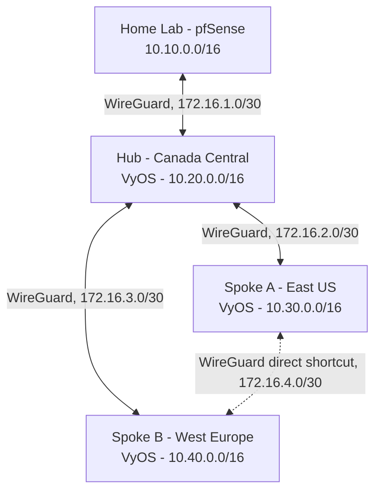

# Lab 5: Multi-Region SD-WAN on Azure (WireGuard Mesh)

Part of a self-directed home lab series building toward hands-on network security fundamentals. This lab moved from a single-site Hyper-V environment onto real multi-region cloud infrastructure to build and diagnose a hub-and-spoke SD-WAN overlay from first principles, without relying on a managed SD-WAN product.

**[Live traffic flow diagram &rarr;](https://www.techwithcharles.ca/labs/sdwan-traffic-flow.html)**, an interactive view of the four tunnels, the direct spoke shortcut, and exactly where the hub relay path breaks down.

## Goal

Build a real multi-site network using genuinely separate infrastructure (not simulated), connect the sites with an encrypted overlay, and demonstrate the core mechanics behind SD-WAN: multiple paths, a preferred direct route between two sites, and a hub that can relay traffic when needed.

## Architecture



Four sites, four WireGuard tunnels. Three edge routers run VyOS on Azure (chosen over pfSense in the cloud because pfSense's cloud story is either a paid Marketplace product or a manual VHD upload, while VyOS has a free official Azure Marketplace image built for this exact use case). The home site keeps its existing pfSense gateway from earlier labs.

## IP addressing

| Site | Subnet | Role |
|---|---|---|
| Home Lab | 10.10.0.0/16 | Existing pfSense environment |
| Hub (Canada Central) | 10.20.0.0/16 | Relay point |
| Spoke A (East US) | 10.30.0.0/16 | Branch site |
| Spoke B (West Europe) | 10.40.0.0/16 | Branch site |
| Transit overlay | 172.16.0.0/16 | WireGuard point to point links, one /30 per tunnel |

Separating the transit addressing from each site's real subnet made every routing table and packet capture in this lab immediately readable: any 172.16.x address is tunnel plumbing, everything else is real site traffic.

## Provisioning

All Azure infrastructure (resource groups, VNets, NSGs) was built with Azure CLI from PowerShell rather than clicked through the Portal, both for speed and to keep the build reproducible. VM deployment itself went through the Portal, since the CLI's image discovery command for the VyOS Marketplace listing repeatedly hung.

Each Azure NSG was scoped to allow SSH only from the home public IP, WireGuard traffic on the relevant ports, and ICMP for diagnostics. Each site's own VyOS or pfSense firewall provided a second layer on top of that, real defense in depth rather than relying on the cloud provider's perimeter alone.

## What's proven

All four tunnels were independently verified with real bidirectional traffic and genuine cross-region latency, not simulated:

| Link | Result | RTT |
|---|---|---|
| Home &harr; Hub | 0% loss, real handshake and RX/TX traffic confirmed | local |
| Hub &harr; Spoke A (Canada Central &harr; East US) | 7/7 packets, 0% loss | ~20 ms |
| Hub &harr; Spoke B (Canada Central &harr; West Europe) | 6/6 packets, 0% loss | ~87 ms |
| Spoke A &harr; Spoke B direct (East US &harr; West Europe) | 9/10 packets | ~82 ms |

The direct Spoke A to Spoke B tunnel is the actual SD-WAN piece: two branch sites reaching each other over a shortcut path instead of detouring through the hub, the same idea real SD-WAN vendors sell as dynamic path selection.

## Two diagnosed limitations

Two deeper features (full mesh transit routing and automatic failover) were attempted, methodically root caused, and ultimately left unresolved rather than patched around. Both are documented here because the diagnostic process was the more valuable outcome.

### 1. pfSense's WireGuard package cannot compile firewall rules for an unassigned tunnel interface

Traffic transiting through the mesh (for example Spoke A talking to Home by way of the Hub) needs a pfSense firewall rule permitting it. Every rule created on the generic WireGuard tab appeared correctly configured in the GUI, protocol set to any, source and destination set to any, yet none of it ever reached the actual running firewall.

Confirmed with the packet filter's own ground truth rather than trusting the GUI:

```
pfctl -sr | grep -i wg1
```

This showed zero compiled rules for the tunnel at all. The fix was assigning the tunnel as a real pfSense interface (System &gt; Interfaces &gt; Assignments) rather than leaving it unassigned, at which point a dedicated rule tab and a properly compiling gateway and static route table became available.

Even after that fix, every rule created on the newly assigned interface, including a fresh Floating rule, compiled with an unwanted TCP only flags clause baked in regardless of what protocol was actually selected:

```
pass in quick on tun_wg1 inet proto tcp all flags S/SA keep state
```

Confirmed independently with `tcpdump` on both sides of the Hub simultaneously that the Hub itself was forwarding every packet correctly, and with pfSense's own firewall log that the traffic was landing on the implicit default deny rule. That isolates the bug specifically to this pfSense build's rule generator for this tunnel, not a configuration mistake.

### 2. WireGuard's cryptokey routing model does not have a simple mesh wide trust shortcut

A static route alone is not enough for a WireGuard peer to accept traffic. Each peer's AllowedIPs list is also a source filter: a packet arriving with a source address the peer does not explicitly recognize gets silently rejected, even if the route that delivered it was entirely correct.

Building a Spoke A to Spoke B failover path through the Hub required widening AllowedIPs at every single hop the traffic could touch, the Hub's peer entries for each spoke, and each spoke's own peer entry for the Hub. Every hop was eventually confirmed correct through `show configuration commands`, yet the failover path still would not pass traffic. This was treated as a second diagnosed but unresolved limitation rather than continuing to spend cloud hours chasing it, since every known cause (routing selection, kernel and Azure NIC level forwarding, AllowedIPs trust at each hop) had already been individually confirmed correct.

## Other real world lessons from this build

- Azure requires NIC level IP forwarding (`az network nic update --ip-forwarding true`) for any VM acting as a router, separate from the OS's own kernel forwarding setting.
- A home ISP's rotating public IP silently broke SSH to every Azure NSG scoped to it at once. If several unrelated resources fail identically at the same time, checking your own public IP first is worth it before assuming a remote fault.
- VyOS does not persist uncommitted configuration changes across a dropped SSH session, and separately, `systemd-tmpfiles-clean.timer` will quietly remove a manually created `/run/sshd` directory a few minutes after boot unless it is declared as a proper tmpfiles.d rule, both of which caused real, repeatable SSH outages during this build.
- Each WireGuard interface on the same box needs its own unique listening port, and adding a new tunnel interface on an Azure hosted box means updating the Azure NSG's allowed port range in addition to the tunnel's own configuration.

## Cost and teardown

Built and fully torn down within a single working session using `az group delete` across all three resource groups, confirmed empty afterward. No standing Azure spend from this lab.

## Stack

Azure CLI, Azure VNets and NSGs, VyOS 1.5 (FRRouting), pfSense CE, WireGuard, tcpdump, pfctl.
